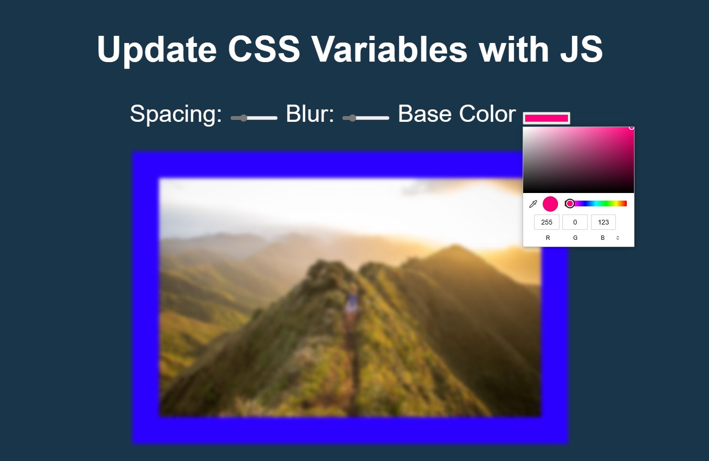

# Variables

## Badges
  
    
  
  ## Description
  #JavaScript30 - Project #3 - Update CSS Variables with JS
   

  This application uses the following technologies: JavaScript and CSS.
    
  Quick demo on updating CSS variables using JavaScript. Reviews data attributes (data-sets) and input types. 
    
  Grab the course at [https://JavaScript30.com](https://JavaScript30.com)
    
  

## Table of Contents
  - [Installation](#installation)
  - [Usage](#usage)
  - [Credits](#credits)
  - [Questions](#questions)
    

  ## [Installation](#table-of-contents)
  The repository is on GitHub: [GitHub repository for Variables.](https://github.com/jsalexan/variables)  
  There you will find following file types:  
  -HTML 
  -Markdown 
    
  
  
    

  ## [Credits](#table-of-contents) 
  All credit to Wes Bos for the fun tutorial: [Website](https://wesbos.com/about)

  
   
 
  ## [Questions](#table-of-contents)
  If you have any questions or comments, please contact  Jennifer Alexander at jsa.wa.us@gmail.com  or visit my profile at [GitHub](https://github.com/jsalexan/).
  

